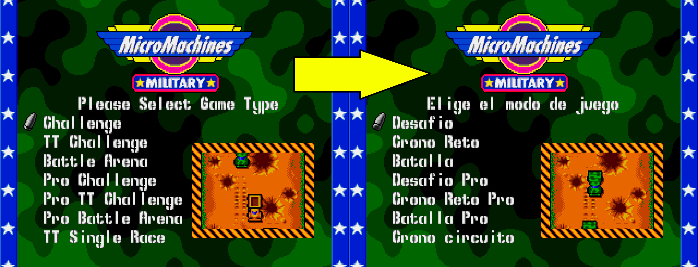

# Parche de traducción al español de Micro Machines Military: It's a blast! de SEGA MEGADRIVE/GENESIS
Por motivos legales no se proporciona la ROM del juego.

## Instrucciones del parche
Aplicar el parche .ips con un programa con capacidad de inyectar archivos IPS como [Lunar IPS](https://fusoya.eludevisibility.org/lips/index.html).
Debe hacerse sobre la ROM del archivo: Micro Machines Military (Europe) (J-Cart).md

## Notas del parche
Se han traducido todos los textos que no involucran gráficos.

## Descripción del juego
Micro Machines Military para Mega Drive es un videojuego de carreras y combate en miniatura. En lugar de vehículos convencionales, el juego cuenta con vehículos militares en miniatura como tanques, helicópteros, jeeps armados, buques de guerra, etc.

Los jugadores compiten en escenarios temáticos a través de diferentes modos de juego: como carreras clásicas, por eliminación, y contrarreloj, donde se puede competir contra la IA o amigos. Como curiosidad, el cartucho J-Cart de este juego en la consola permite conectar hasta cuatro controles adicionales potenciando la experiencia multijugador.

## Créditos

> Creado por AlexArroyoDuque

> [https://www.romhacking.net/](https://www.romhacking.net/)
